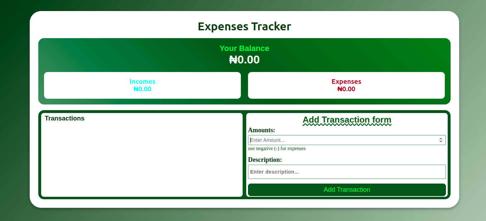

# Expense Tracker 💰

A simple, responsive, and interactive **Expense Tracker Web App** built with **HTML, CSS, and JavaScript**.  
This project helps users keep track of incomes and expenses, calculate balances automatically, and persist data using the browser’s local storage.

---

## 🚀 Features
- ✅ Add transactions (income or expense).  
- ✅ Use **negative values** for expenses and **positive values** for incomes.  
- ✅ Automatically calculates **total balance, income, and expenses**.  
- ✅ Displays a **scrollable transaction list**.  
- ✅ Delete individual transactions.  
- ✅ Data persistence with **LocalStorage** (transactions remain after page reload).  
- ✅ Clean and responsive UI with modern styling.  

---

## 📂 Project Structure
├── index.html # Main HTML structure
├── style.css # Styles for layout and components
└── script.js # App logic & LocalStorage handling

---

## 🖥️ Demo (How It Works)
1. Enter an **amount**:
   - Example: `500` → income  
   - Example: `-200` → expense  
2. Add a **description**:
   - Example: `"Salary"`, `"Groceries"`, `"Electricity Bill"`  
3. Click **Add Transaction**.  
4. Your transaction appears in the list:  
   - 🟢 **Income** items are shown in green  
   - 🔴 **Expense** items are shown in red  
5. The **Balance, Income, and Expenses** sections update automatically.  
6. Remove transactions anytime using the ❌ delete button.  

---

## 📝 Example Usage
Here’s how transactions look in action:

**Input Example**  
Amount: 1000
Description: Salary

Amount: -300
Description: Groceries

**Displayed in App**
Your Balance: ₦700.00
Income: ₦1,000.00
Expenses: ₦-300.00

## Transactions:
Salary ₦1,000.00
Groceries ₦-300.00

---

## ⚙️ Technologies Used
- **HTML5** – semantic structure  
- **CSS3** – responsive layout, gradients, flexbox, grid  
- **JavaScript (Vanilla JS)** – DOM manipulation, array methods, event handling  
- **LocalStorage** – saving transactions persistently  

---

## 📸 Screenshots

## 📖 Learning Highlights
DOM selection and event handling
Form validation and input handling
LocalStorage for persisting data
Array methods (filter, reduce, forEach, map)
Responsive design with CSS grid and flexbox

## 🚧 Future Improvements
Add categories for transactions
Implement charts (e.g., pie chart for expenses vs. income)
Add dark mode toggle
Export data as CSV/Excel
Add user authentication for multi-user use

## 🛠️ How to Run
Clone the repository:
git clone https://github.com/mrbenworkshop/expense-tracker.git
Open the project folder:
cd expense-tracker
Open index.html in your browser.
(No server required, everything runs locally)

## *👨‍💻 Author*

Built with ❤️ by MRBENWORKSHOP
